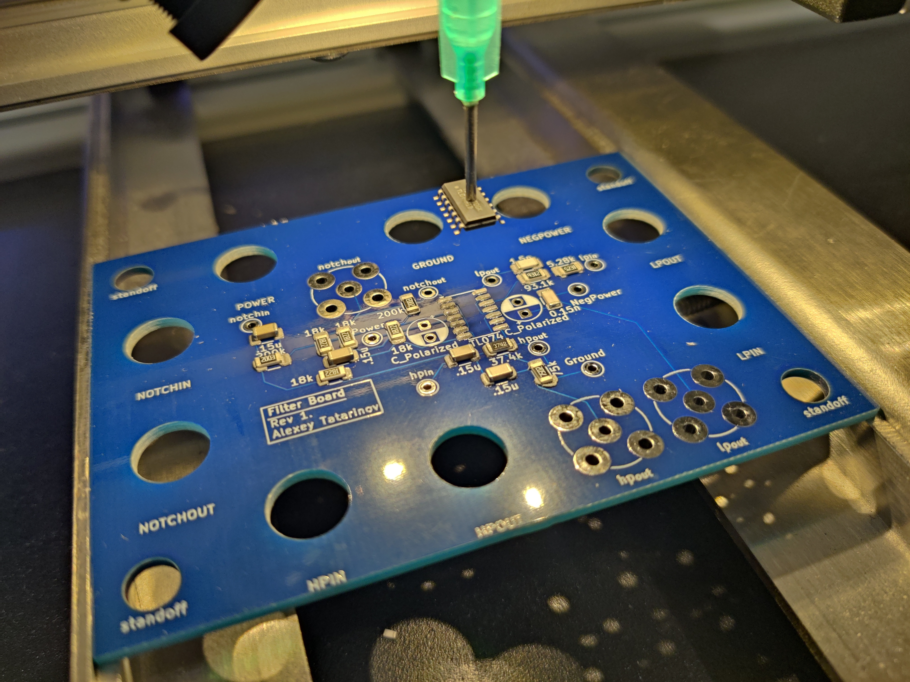
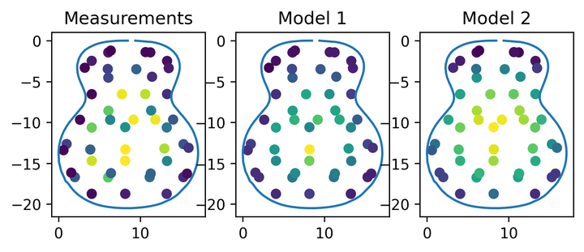
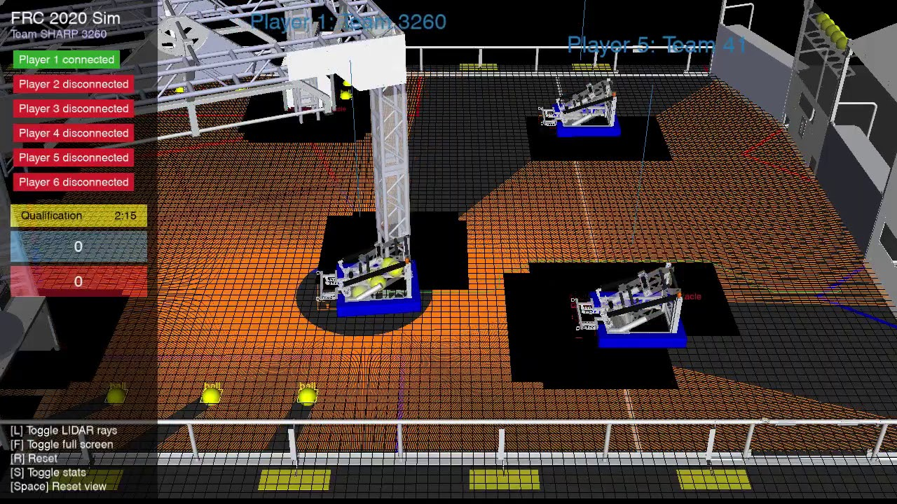
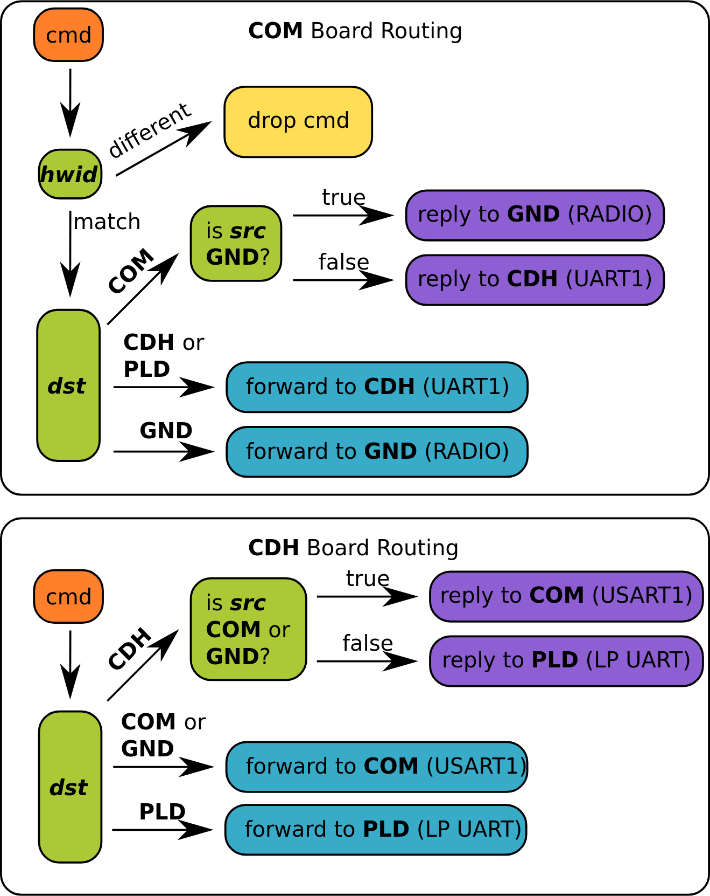
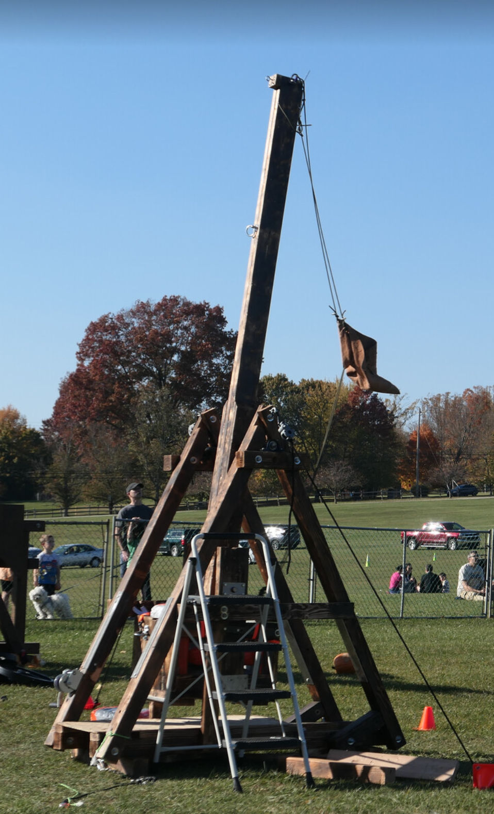
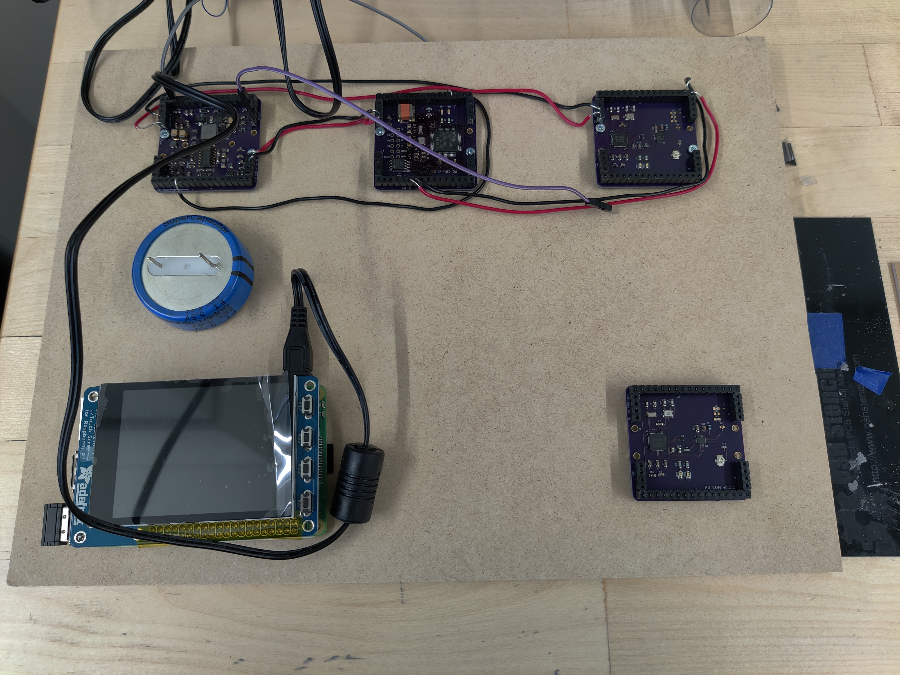
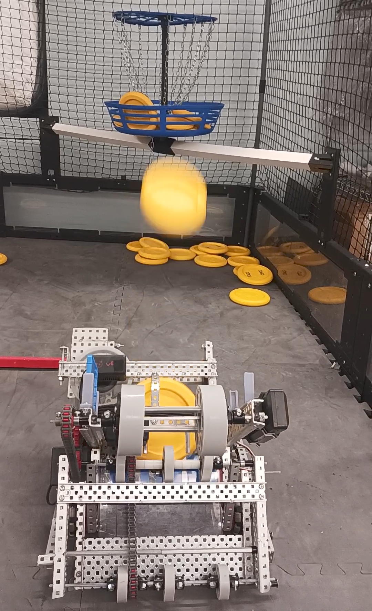
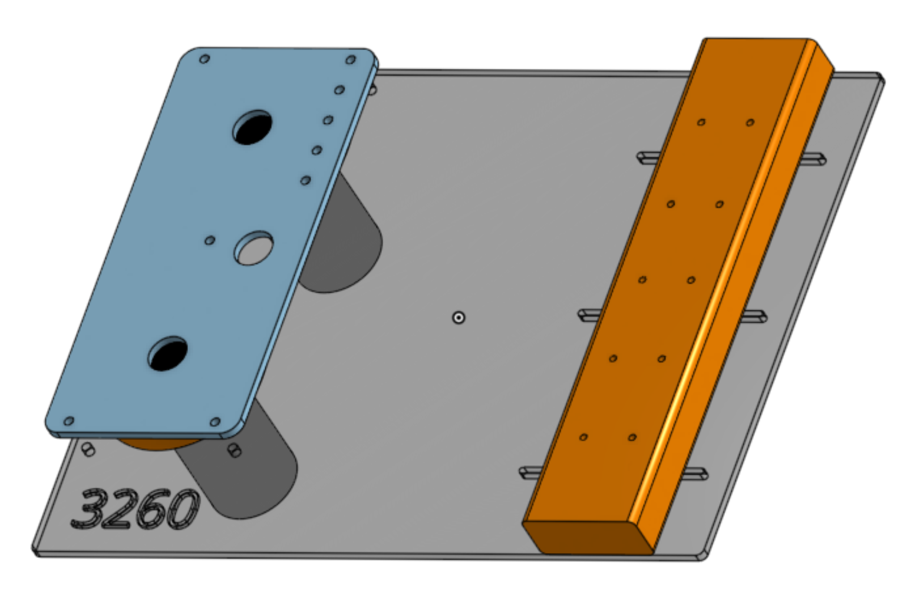

 
# About
I am a 4th year electrical engineering student at the Georgia Institute of Technology graduating May 2027. I love solving challenging problems in interdisciplinary fields.

Some of my favorite things I've done:

- Built a multi-device simulator with logpoint level tracking and capacity
		constraints for Texas Instruments.
- Analyzed acoustic guitar vibrometer data using density-functional
		fluctuation theory (DFFT)
- Extended CMU's TAB protocol to allow mesh communication without changing
		packet layout
- Wrote a Vulkan renderer in Rust using modern bindless techniques

In my free time I enjoy sailing, rock climbing and photography.

 
# Projects
<ul class="Grid">
	<li class="Card">
		
		

		

		Analog Audio Filter Board
		

	</li>
	<li class="Card">
		
		

		

		NFFT Based Characterization
		

	</li>
	<li class="Card">
		
		

		

		Autonomous FRC Robot Algorithm
		

	</li>	
	<li class="Card" data-double>
		
		

		

		Robust Routing Architecture for Nanosatellites
		

	</li>	
	<li class="Card" data-double>
		
		

		

		Pumpkin Trebuchet
		

	</li>
	<li class="Card">
		
		

		

		FlatSat Board for Nanosatellites.
		

	</li>
	<li class="Card">
		
		

		

		Automatic Disc Shooting Algorithm
		

	</li>
	<li class="Card">
		
		

		

		Frisbee Robot	
		

	</li>
</ul>

